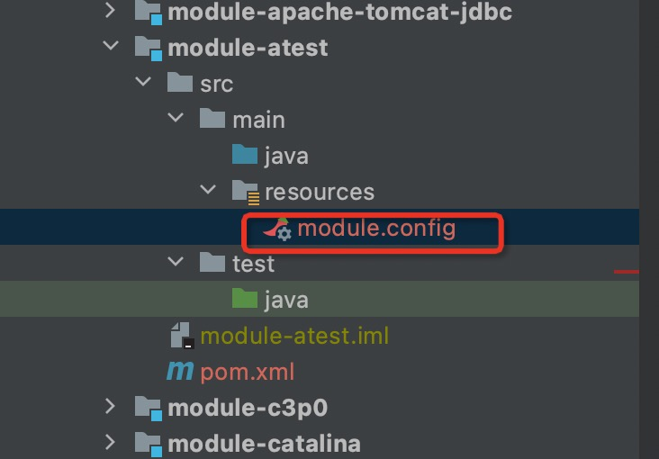
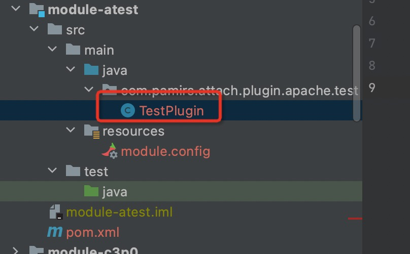

# Plug-in development instruction

### Add Maven child modules in user-modules 


### Modify plug-in pom.xml

1.Add `module-name` in `properties`:

```
<properties>
    <module-name>aerospike</module-name>
</properties>
```
2.Add the following dependencies

```aidl
<dependency>
    <groupId>com.shulie.instrument.simulator</groupId>
    <artifactId>instrument-simulator-api</artifactId>
    <!--Make sure the version is newest-->
    <version>1.0.1</version>
    <scope>provided</scope>
</dependency>
<dependency>
    <groupId>com.shulie.instrument.simulator</groupId>
    <artifactId>instrument-simulator-base-api</artifactId>
    <!--Make sure the version is newest-->
    <version>1.0.1</version>
    <scope>provided</scope>
</dependency>
<dependency>
    <groupId>com.shulie.instrument.simulator</groupId>
    <artifactId>instrument-simulator-messager</artifactId>
    <!--Make sure the version is newest-->
    <version>1.0.1</version>
    <scope>provided</scope>
</dependency>
<dependency>
    <groupId>org.kohsuke.metainf-services</groupId>
    <artifactId>metainf-services</artifactId>
    <version>1.7</version>
    <scope>compile</scope>
</dependency>
<dependency>
    <groupId>com.shulie.instrument.module</groupId>
    <artifactId>simulator-internal-bootstrap-api</artifactId>
    <version>1.0.0</version>
    <!--Make sure the version is newest-->
    <scope>provided</scope>
</dependency>
<dependency>
    <groupId>com.shulie.instrument.module</groupId>
    <artifactId>simulator-bootstrap-api</artifactId>
    <version>1.0.0</version>
    <!--Make sure the version is newest-->
    <scope>provided</scope>
</dependency>
<dependency>
    <groupId>com.shulie.instrument.module</groupId>
    <artifactId>module-pradar-core</artifactId>
    <!--Make sure the version is newest-->
    <version>1.0.0</version>
    <scope>provided</scope>
</dependency>
```

### 3.Add module.config file

Add a properties file named module.config in resource directory.



The content is as follows：

```aidl
#Module name, same as module name above
module-id=aerospike
#The exported class name is full path, comma separated if there are multiple paths
#export-class=
#The imported class name is full path, but not required if there is no one. Multiple are separated by commas. If you rely on the classes in other modules, you will not only add the dependency of other modules to POM file, and need to import corresponding classes in the configuration file, and ensure that the dependent modules have been loaded. Please refer to switch control
#import-class=
#The exported package name, separated by commas, supports matching. For example, com.pamirs. * export all the classes below com.pamirs
#export-package=
#The imported package name, separated by commas, supports matching. For example, com.pamirs. * all classes under com.pamirs are imported
import-package=com.pamirs.pradar.*
#List of exported resources, multiple separated by commas
#export-resource=
#List of imported resources, multiple separated by commas

# define a switcher to management module load. call GlobalSwitch to change switcher status,
# it will trigger module loading if switcher is on, multi switcher split with comma

#The names of the dependent switches are separated by commas. The name of the dependent module can be filled in. The module will start when it is activated
#If a module needs to wait for a logic in the dependent module to be executed or executed correctly, it can be implemented by loading globalswitch. Switchon() or globalswitch. Switchoff
#Manual switch
switch-control=clusterTestSwitcher
#The simulator framework version number range supported by the current module. The currently running framework version number is not included in the module's support list, and the corresponding module will be printed
#Version is not supported, the format is: start version number-end version number, if the start version number is not written, it defaults to the minimum version number, if the end version number is not written, it defaults to the maximum version number 
simulator-version=1.0.0-
```

For all the above import and export, you need to confirm whether the dependent module has got class, package or resource when importing, otherwise the class, package, resource will not be found.

### 4.Encoding

1. Add ExtensionModule class declaration



```aidl
import com.pamirs.pradar.interceptor.Interceptors;
import com.shulie.instrument.simulator.api.ExtensionModule;
import com.shulie.instrument.simulator.api.ModuleInfo;
import com.shulie.instrument.simulator.api.ModuleLifecycleAdapter;
import com.shulie.instrument.simulator.api.instrument.EnhanceCallback;
import com.shulie.instrument.simulator.api.instrument.InstrumentClass;
import com.shulie.instrument.simulator.api.instrument.InstrumentMethod;
import com.shulie.instrument.simulator.api.listener.Listeners;
import com.shulie.instrument.simulator.api.resource.ReleaseResource;
import com.shulie.instrument.simulator.api.scope.ExecutionPolicy;
import org.kohsuke.MetaInfServices;

@MetaInfServices(ExtensionModule.class)
@ModuleInfo(id = "test", version = "1.0.0", author = "test@shulie.io",description = "这只是一个测试插件")
public class TestPlugin extends ModuleLifecycleAdapter implements ExtensionModule {
    @Override
    public void onActive() throws Throwable {
        //增强的目标 class 是xxxx.xxxx.Test
        enhanceTemplate.enhance(this, "xxxx.xxxx.Test", new EnhanceCallback() {
            //参数为匹配的 增强Class 对象
            @Override
            public void doEnhance(InstrumentClass target) {
                //对目标方法进行增强,参数列表为 java.lang.String, int
                //即方法的声明为 test(String xxx,int xxx),因为方法名称和方法参数就可以唯一定位一个方法了
                final InstrumentMethod method = target.getDeclaredMethod("test", "java.lang.String", "int");
                method.addInterceptor(Listeners.of(TestInterceptor.class)); //使用的拦截器为无参拦截器，并且是可以在一次调用中反复执行的
                
                
                //如果拦截器是需要传递参数，则添加参数
                method.addInterceptor(Listeners.of(TestInterceptor.class, 参数1...参数 N));
                
                //如果拦截器在一次调用中只能被执行一次
                //作用域名称可以一个拦截器使用一个，则这个拦截器只会在一次调用中执行一次，如果多个拦截器使用同一个，则代表一次调用中只会执行其中的一个拦截器
                //ExecutionPolicy 分为三种，一种是 ALWAYS,代表每次都会执行. BOUNDARY代表为有界限的，只会被执行1次，INTERNAL代表只会在这个作用域下只
                //会在其他有拦截器执行后再执行。Interceptors.SCOPE_CALLBACK为默认的作用域回调实现
                method.addInterceptor(Listeners.of(TestInterceptor.class, "作用域名称", ExecutionPolicy.BOUNDARY, Interceptors.SCOPE_CALLBACK));
                
                    
            }
        });
    }
}
```

2.Add interceptor

The interceptor is the realization of the enhancement of the target class logic. We realize the logic of the transmission of the pressure test target and the data isolation.

We can choose to inherit different Interceptor base classes according to different scenarios

-AroundInterceptor can handle method execution before, after method execution, and after method execution exception at the same time

Example:
```aidl
/**
 * AroundInterceptor 可以同时处理方法执行前、方法执行后，方法执行异常后
 *
 */
public TestInterceptor extends AroundInterceptor {
    /**
     * 方法执行前处理逻辑定义
     */
    @Override
    public void doBefore(Advice advice) throws Throwable {
        
    }
    
    /**
     * 方法执行后处理逻辑定义
     */
    @Override
    public void doAfter(Advice advice) throws Throwable {
        
    }
    
    /**
     * 方法执行异常后处理逻辑定义
     */
    @Override
    public void doException(Advice advice) throws Throwable {
        
    }
}
```

- ParametersWrapperInterceptorAdaptor 可以修改原方法的入参

示例：
```aidl
public class TestInterceptor extends ParametersWrapperInterceptorAdaptor {
    public Object[] getParameter0(Advice advice) throws Throwable {
        //获取到方法的参数,需要注意的是方法参数不能减少或者增加，并且也不能改变类型，只可以改变其中的一个值
        Object[] args = advice.getParameterArray();
        args[0]=xxxx;
        return args;
    }
}
```

- ResultInterceptorAdaptor 可以修改原方法的返回值

示例：

```aidl
public class TestInterceptor extends ResultInterceptorAdaptor {
    public Object getResult0(Advice advice) throws Throwable {
        //不能修改结果的类型
        Object result = advice.getReturnObj();
        
        result = xxxxx;
        return result;
        
    }
}
```

- TraceInterceptorAdaptor 实例方法埋点的环绕拦截器抽象实现,可实现追踪埋点与压测增强的混合逻辑

示例：

```aidl
public class TestInterceptor extends TraceInterceptorAdaptor {
    //记录的 trace 日志是否是调用端，日志分为调用端和服务端,如果为 true 为调用端，false 为服务端，默认true
    @Override
    public boolean isClient(Advice advice) throws Throwable {
        return true;
    
    }
    
    //记录的 trace 日志是否是入口，默认为 false
    @Override
    public boolean isTrace(Advice advice) throws Throwable {
        return false;
    }
    
    
    @Override
    public void beforeFirst(Advice advice) throws Throwable {
        //可以在记录方法执行前日志之前在这里处理一些逻辑
    }
    
    @Override
    public void beforeLast(Advice advice) throws Throwable {
        //可以在记录方法执行前日志之后在这里处理一些逻辑
    }
    
    @Override
    public void afterFirst(Advice advice) throws Throwable {
        //可以在记录方法执行后日志之前在这里处理一些逻辑
    }
    
    @Override
    public void afterLast(Advice advice) throws Throwable {
        //可以在记录方法执行后日志之后在这里处理一些逻辑
    }
    
    @Override
    public void exceptionFirst(Advice advice) throws Throwable {
        //可以在记录方法执行异常后日志之前在这里处理一些逻辑
    }
    
    @Override
    public void exceptionLast(Advice advice) throws Throwable {
        //可以在记录方法执行异常后日志之后在这里处理一些逻辑
    }
    
    
    @Override
    public SpanRecord beforeTrace(Advice advice) throws Throwable {
        SpanRecord record = new SpanRecord();
        //记录的是服务名称，这个是必须的
        record.setService("服务名");
        //记录的是方法名称，这个是必须的
        record.setMethod("方法名");
        //记录的远程 IP，如果获取不到就不设置
        record.setRemoteIp("");
        //记录的远程端口,如果没有就不用
        record.setPort(80);
        //需要记录的入参，可以直接取当前方法参数，需要自定义则自己组装参数
        record.setRequest(advice.getParameterArray());
        return record;
    }
    
    @Override
    public SpanRecord afterTrace(Advice advice) throws Throwable {
        SpanRecord record = new SpanRecord();
        //需要记录的出参，可以直接取当前方法出参，需要自定义则自己组装
        record.setResponse(advice.getReturnObj());
        return record;
    }
    
    @Override
    public SpanRecord exceptionTrace(Advice advice) throws Throwable {
        SpanRecord record = new SpanRecord();
        //需要记录的异常，可以直接取当前方法执行时抛出的异常，需要自定义则自己组装
        record. setResponse(advice.getThrowable());
        //设置日志的结果编码，默认是执行成功，因为这个地方是失败，所以需要记录成失败
        record.setResultCode(ResultCode.INVOKE_RESULT_FAILED);
        return record;
    }
}
```
